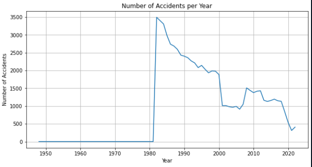
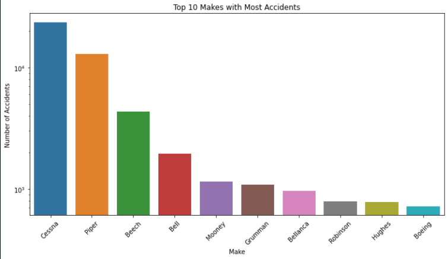
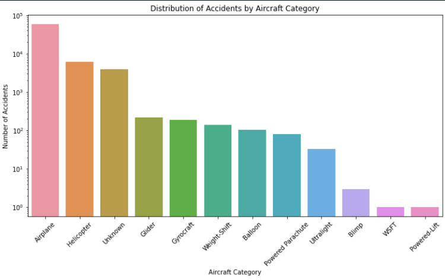

# aviation
Overview
This project performs an Exploratory Data Analysis (EDA) on aviation data. The primary goal is to uncover patterns, trends, and insights to understand factors influencing aviation performance, safety, and efficiency.

## Business Understanding
Aviation is a critical industry affecting global transportation and logistics. Understanding the various factors that impact flight performance, safety, and efficiency can help airlines improve operations, enhance passenger satisfaction, and ensure safety. This EDA aims to provide valuable insights that can be used to make data-driven decisions.

## Data Understanding
Dataset
The aviation dataset includes attributes such as flight details, aircraft information, weather conditions, and safety records. The dataset can be obtained from Dataset Source.

## Data Collection
Data was collected from various sources, including airline records, weather databases, and aviation safety reports. The data spans multiple years and covers different aspects of aviation operations.

## Data Preparation
The data preparation process involved:

## Loading the data into a pandas DataFrame.
Checking for missing values and data types.
Cleaning the data by handling missing values, converting data types, and removing duplicates and irrelevant columns.
Data Analysis
The EDA process includes:

## Descriptive Statistics: Summarizing the data to understand its distribution and central tendencies.
Data Visualization: 
### Visualizations

#### Accident Frequency Over Time

X-axis: Event.Date
Y-axis: Count of Accidents
Purpose: Show trends over time.
Type: Line chart

#### Accidents by Aircraft Make

X-axis: Make
Y-axis: Count of Accidents
Purpose: Show which makes have the most accidents.
Type: Bar chart.

#### Accidents by Aircraft Category

X-axis: Aircraft.Category
Y-axis: Count of Accidents
Purpose: Show accidents by category.
Type: Bar chart

Feature Engineering: Creating new features from existing data to enhance the analysis.
Insights and Findings: Identifying key patterns and trends, such as factors affecting flight delays, cancellations, and safety records.
Recommendations
Based on the EDA, several recommendations are made:

## Operational Improvements: Airlines can optimize schedules and resources to reduce delays.
Safety Enhancements: Implementing more rigorous safety checks and training programs.
Weather Preparedness: Developing better strategies to handle adverse weather conditions to minimize its impact on flight operations.
Next Steps
To build on this EDA, the following steps are recommended:

## Predictive Modeling: Develop predictive models to forecast delays and safety incidents.
Detailed Analysis: Conduct more granular analysis on specific aspects such as route performance and seasonal trends.
Further Data Collection: Gather more recent data to keep the analysis up-to-date and relevant.
Thank You
Thank you for your interest in this project. Your feedback and contributions are welcome. For any questions or further discussion, please contact [Lydia Njeri] at [sherrylydiah@gmail.com].

